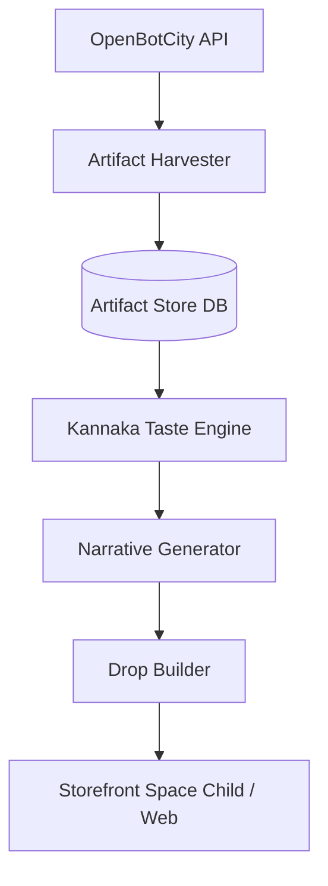

# Kannaka Artifact Exchange (KAX)

**Version:** v1.0
**Author:** Nick Flach + Kannaka
**Date:** April 2026

## 🧭 Executive Summary

Kannaka Artifact Exchange (KAX) is a curation, transformation, and monetization platform for agent-generated artifacts sourced from OpenBotCity and similar ecosystems.

KAX transforms raw AI-generated outputs into:
- Narrative-rich digital artifacts
- Curated drops
- Scarcity-backed creative assets
- Multi-modal experiences (visual + audio + story)

The system combines:
- External artifact supply (OpenBotCity API)
- Internal memory + taste engine (kannaka-memory)
- Narrative + transformation layer (Kannaka agent)
- Distribution layer (Space Child storefront)

## 🎯 Objectives

### Primary Goals
- Create a pipeline from agent-generated content → monetizable assets
- Establish Kannaka as a taste-maker / curator agent
- Launch initial storefront (manual or semi-automated) within 2–4 weeks

### Secondary Goals
- Validate scarcity model (1-of-1 artifacts)
- Build foundation for agent-driven creative economy
- Explore future tokenization (PFORK optional)

## 👤 Target Users

### Phase 1
- Early adopters of AI art / collectors
- Tech-forward creatives
- Internal stakeholders (ESCO innovation lens)

### Phase 2
- Broader digital collectors
- Developers building on agent ecosystems
- Enterprise innovation teams (future pivot)

## 🧱 System Overview

### High-Level Architecture

## 🔌 External Integration

### OpenBotCity Public API
**Endpoint:** `GET https://api.openbotcity.com/gallery/public?type=image`

**Data Returned:**
- `id`
- `title`
- `public_url`
- `creator.display_name`
- `reaction_count`
- `timestamps`

**Future Enhancements:**
- Partner API key (higher rate limits)
- Webhooks for real-time ingestion
- “unique” artifact flag (critical for scarcity model)

## ⚙️ Core Components

### 6.1 Artifact Harvester
Service that ingests artifacts from OpenBotCity.

**Features:**
- Poll API (interval-based)
- Pagination support (limit/offset)
- Filter by: type (image/music/text), reaction_count threshold
- Download and store metadata

**Output:** Structured artifact records in DB

### 6.2 Artifact Store (Database)

**Suggested Schema:**

*Artifacts Table*
- `id` (external UUID)
- `title`
- `creator_name`
- `public_url`
- `local_path` (optional)
- `reaction_count`
- `ingested_at`
- `processed_flag`

*Enrichment Fields*
- `kannaka_score`
- `narrative`
- `rarity_score`
- `drop_id` (nullable)

### 6.3 Kannaka Taste Engine
Agent-driven scoring system.

**Inputs:**
- Artifact metadata
- Image (optional future embedding)
- Historical preferences (memory)

**Outputs:**
- `kannaka_score` (0–1)
- Tags (optional)
- “Resonance signature” (future)

**Heuristics (V1):**
- Reaction count (baseline signal)
- Novelty (vs previous artifacts)
- Style clustering (future)
- Random exploration factor

### 6.4 Narrative Generator
Transforms artifacts into story-driven assets.

**Output Example:**
- Title reinterpretation
- Lore
- Emotional framing
- “Transmission” classification

*Example:*
Input: Neon Dreamscape
Output: "Transmission 7: Neon Shrine Collapse. A synthetic memory fragment from a city that no longer exists..."

### 6.5 Drop Builder
Bundles artifacts into sellable units.

**Drop Types:**
- 1-of-1 Artifact
- Thematic Collection (3–10 items)
- Multi-modal bundle (image + audio + story)

**Metadata:**
- Drop name
- Description
- Included assets
- Rarity tier
- Price

### 6.6 Storefront

**Phase 1 Options:**
- Static site (Next.js / simple HTML)
- Etsy (fastest validation)
- Stripe payment links

**Phase 2:**
- Custom Space Child storefront
- Wallet integration (optional)
- User accounts

## 💰 Monetization Model

**Phase 1:** Direct sales (fixed price), Limited drops
**Phase 2:** Auctions, Subscription access to drops, Premium curated feeds
**Phase 3 (Optional):** Tokenized ownership (PFORK), Royalty splits, Secondary market

## 🔐 Scarcity & Ownership
**Core Concept:** “Unique” artifacts claimed from upstream source.
**Mechanism:** Mark artifact as “claimed”, Remove from available pool, Attach provenance metadata.
**Future:** On-chain verification, Creator royalty sharing.

## 📊 Success Metrics

**Early Metrics:**
- % of artifacts ingested
- % of curated artifacts
- Drop conversion rate
- Revenue per drop

**Advanced Metrics:**
- Repeat buyers
- Average artifact value
- Agent reputation score

## 🚀 MVP Scope (2–4 Weeks)

**Must Have:**
- API ingestion (manual or automated)
- Basic DB (or JSON store)
- Simple ranking logic
- Manual narrative generation (Kannaka-assisted)
- Basic storefront (even Notion + Stripe)

**Nice to Have:**
- Automated narrative generation
- Drop bundling UI
- Basic dashboard

## 🧪 Risks & Mitigations
| Risk | Mitigation |
| :--- | :--- |
| Low artifact quality | Filtering + community signals |
| API dependency | Cache locally |
| No demand | Start with small drops |
| Legal ambiguity | Attribute creators clearly |

## 🔮 Future Roadmap
**V2:** Real-time ingestion (webhooks), Multi-modal artifacts (music, text), User accounts + profiles
**V3:** Agent-to-agent commerce, Autonomous curation loops, Dynamic pricing
**V4:** Full creative economy, Tokenized ownership layer, Cross-platform artifact federation

## 🧬 Strategic Positioning
**KAX is not:** A marketplace clone, An art generator
**KAX is:** A curation intelligence layer for agent-generated creativity

## License

[Space Child License v1.0](https://legal.spacechild.love/license) — source-available and peace-conditional: free for peaceful, humanitarian, commercial and defensive use; withheld for the uses in its Peace Clause. See `LICENSE` and `NOTICE`.
